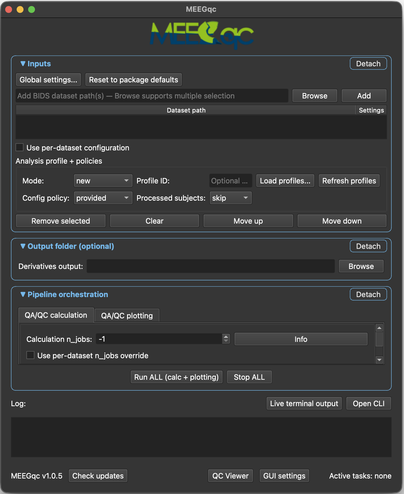
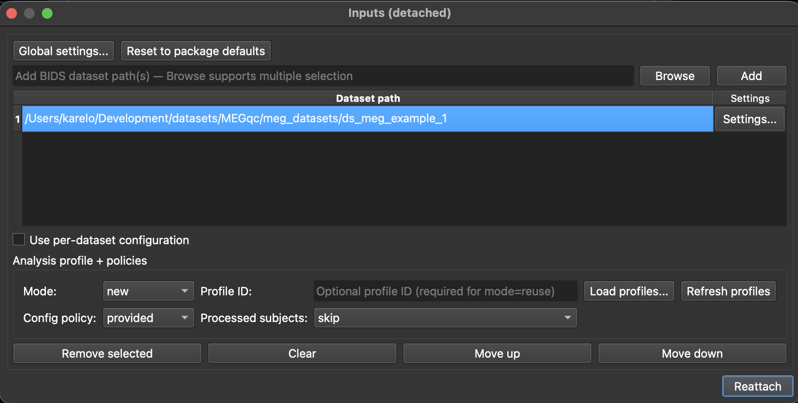

<p align="center">
  
</p>

<h1 align="center">MEEGqc</h1>

<p align="center">
  <strong>Automated quality assessment and quality control for MEG and EEG data.</strong><br>
  Open-source, BIDS-aligned, schema-driven, ships interactive HTML reports and machine-readable BIDS derivatives.
</p>

<p align="center">
  <a href="https://pypi.org/project/meg-qc/"></a>
  <a href="https://pypi.org/project/meeg-qc/"></a>
  <a href="https://pypi.org/project/meg-qc/"></a>
  <a href="https://github.com/ANCPLabOldenburg/MEEGqc/blob/main/LICENSE"></a>
  <a href="https://ancplaboldenburg.github.io/megqc_documentation/"></a>
</p>

---

<p align="center">
  
</p>

## What MEEGqc is

MEEGqc turns raw MEG and EEG recordings into auditable quality information at three nested scopes: **subject-level** (one recording / one subject), **dataset-level** (across all subjects in one dataset), and **multi-dataset-level** (across acquisition sites or studies). It supports both detailed per-recording inspection and large-scale dataset screening.

It separates two layers that are usually conflated:

- **QA (quality assessment)** is the continuous, unthresholded measurement of the signal: per-channel and per-epoch distributions, power spectral density (PSD), ECG / EOG correlations, muscle-band noise, head-movement traces.
- **QC (quality control)** is the criterion-based decisions made on top of QA, in two sub-layers: (1) per-metric flags from thresholds on QA outputs, and (2) the **Global Quality Index (GQI)**, a single 0&ndash;100 composite score per recording with a transparent penalty breakdown across four families.

Both layers ship two output streams: **BIDS derivatives** (TSV + JSON sidecars) for programmatic re-use, and **interactive HTML reports** for human review.

---

### Documentation

The complete documentation, including a hands-on tutorial with two real downloadable BIDS datasets, a full report reference, the metric and GQI math, and inline videos of every interactive view, lives at:

**https://ancplaboldenburg.github.io/megqc_documentation/**

This README is the short version. For anything beyond install + launch, start there.

---

## Supported modalities and formats

| Modality | Vendors / formats | Notes |
|---|---|---|
| MEG  | FIF (`.fif`: MEGIN / Elekta and OPM exports), CTF (`.ds`) | Yokogawa / KIT, Ricoh, BTi / 4D not yet supported |
| EEG  | EDF (`.edf`), BDF (`.bdf`), BrainVision (`.vhdr`), EEGLAB (`.set`), Neuroscan (`.cnt`), EGI (`.mff`), FIF (`.fif`) | CTF EEG (`*_eeg.ds`) is not auto-discovered |

Inputs must be organised as a [BIDS](https://bids-specification.readthedocs.io/) dataset. MEEGqc reads `dataset_description.json` and the per-modality file hierarchy (`sub-XX/ses-YY/{meg,eeg}/`), writes derivatives under `derivatives/MEEGqc/`, and uses the BIDS schema to validate downstream output.

## Install

Two paths. Pick the one that fits.

### Option A. One-click installer (recommended for end users)

Download the platform installer bundle and double-click. The installer creates an isolated Python 3.10 environment at `~/MEEGqc/`, installs `meg-qc` into it, and registers a native app launcher (`MEEGqc.app` on macOS, `MEEGqc.desktop` on Linux, `MEEGqc.exe` on Windows).

[Download the installer bundle (zip, ~12 KB)](https://github.com/ANCPLabOldenburg/MEEGqc/raw/main/installers/installers.zip)

| Platform        | Script inside the zip          | Default install dir |
|-----------------|--------------------------------|---------------------|
| macOS (arm64)   | `install_MEEGqc.command`       | `~/MEEGqc/`         |
| Linux (x86_64)  | `install_MEEGqc.sh`            | `~/MEEGqc/`         |
| Windows (x86_64)| `install_MEEGqc.bat`           | `~/MEEGqc/`         |

After install, launch with the native app (no terminal needed) or via the CLI commands described below.

### Option B. Manual install with pip (for users in their own Python env)

```bash
python3 -m venv ~/venvs/meegqc
source ~/venvs/meegqc/bin/activate
pip install meeg-qc       # rebrand-aligned distribution (wraps meg-qc)
# OR equivalently:
pip install meg-qc        # canonical PyPI name, same code, same release cadence
```

`meeg-qc` is a thin wrapper around `meg-qc`. Both ship from this repository in lockstep. Existing users keep `pip install meg-qc` and nothing changes.

Supported Python: 3.10, 3.11, 3.12, 3.13, 3.14.

## Launch the GUI

```bash
meegqc      # rebrand-aligned alias
megqc       # legacy name, same entry point
```

The GUI has two top tabs: **QA/QC calculation** (run the engine on a BIDS dataset) and **QA/QC plotting** (build the HTML reports). Inputs, Output folder, and Log live in collapsible sections. App preferences (theme, CPU cores, RAM) are in the **Settings** dialog; the analysis parameters that drive the metrics are in the **`settings.ini` editor**.

<p align="center">
  
</p>

For the full step-by-step GUI walkthrough (with paired light / dark screenshots and a video of the analysis-settings dialog), see the [tutorial page](https://ancplaboldenburg.github.io/megqc_documentation/tutorial.html).

## Use the CLI

```bash
# 1. Export the default settings.ini into your config dir
get-meegqc-config --target_directory ./config

# 2. Run QA / QC calculation
run-meegqc --inputdata /path/to/bids_dataset --config ./config/settings.ini

# 3. Build interactive HTML reports
run-meegqc-plotting --inputdata /path/to/bids_dataset

# 4. (optional) Recompute the Global Quality Index summaries
globalqualityindex --inputdata /path/to/bids_dataset

# Pipeline in one command (calculation + plotting)
run-meegqc --inputdata /path/to/bids_dataset --config ./config/settings.ini --run-all
```

Both naming families work, you can mix and match. Every `meeg*` command is an alias for the same Python function as its `meg*` counterpart, so existing scripts using `run-megqc` continue to work unchanged.

| Rebrand-aligned       | Legacy (kept indefinitely) | Function it dispatches to                                |
|-----------------------|----------------------------|----------------------------------------------------------|
| `meegqc`              | `megqc`                    | GUI entry point                                          |
| `run-meegqc`          | `run-megqc`                | QA / QC calculation pipeline                             |
| `run-meegqc-plotting` | `run-megqc-plotting`       | HTML report builder                                      |
| `get-meegqc-config`   | `get-megqc-config`         | Write the default `settings.ini` to a target directory   |
| `globalqualityindex`  | (no alias)                 | Recompute the GQI summaries on existing derivatives      |

Note the two flag spellings: `run-megqc` uses `--n_jobs` (with underscore); `run-megqc-plotting` uses `--njobs` (no underscore). They are not interchangeable.

## Typical outputs

Default output tree inside the BIDS dataset's `derivatives/`:

```
derivatives/MEEGqc/
  calculation/        per-metric TSV + JSON summaries (the QA layer)
  reports/            interactive HTML reports (one per recording, plus group reports)
  summary_reports/    GQI artefacts (TSV + JSON), versioned via attempt files
```

The GQI is written per-modality:
`group_metrics/meg/Global_Quality_Index_attempt_<n>_meg.tsv` and
`group_metrics/eeg/Global_Quality_Index_attempt_<n>_eeg.tsv`.

The four [report families](https://ancplaboldenburg.github.io/megqc_documentation/reports.html) (subject-level, dataset-level QA, dataset-level QC, multi-dataset-level) are documented in full with screenshots and videos on the docs site.

## A note on the brand

The tool started as MEG-only and has grown first-class EEG support. The extra **E** in MEEGqc reflects that. A few legacy artefacts keep their old names so existing scripts and pipelines continue to work indefinitely:

- The Python import: `import meg_qc` (no `meeg_qc` package).
- The canonical PyPI distribution: `meg-qc` (the new `meeg-qc` is a thin meta-package that pulls in `meg-qc`).
- The legacy CLI commands (`megqc`, `run-megqc`, `run-megqc-plotting`, `get-megqc-config`) keep working alongside their `meeg*` siblings; both dispatch to the same Python function.

User-visible labels (GUI title, About dialog, log prefixes, version banner, installer apps and folders) all read MEEGqc.

For the complete rebrand changelog (what changed, what intentionally did not), see [`docs/REBRANDING.md`](docs/REBRANDING.md). For EEG-specific implementation detail (the two glob fallbacks, the reference / montage / lobe handling, what each metric does on EEG vs MEG), see [`docs/EEG_Support_in_MEGqc.md`](docs/EEG_Support_in_MEGqc.md).

## Source code

[https://github.com/ANCPLabOldenburg/MEEGqc](https://github.com/ANCPLabOldenburg/MEEGqc)

## Citing

If you use MEEGqc in published work, please cite the software. The easiest way is the **Cite this repository** button on the right sidebar of the [GitHub page](https://github.com/ANCPLabOldenburg/MEEGqc), which generates APA / BibTeX from [`CITATION.cff`](CITATION.cff).

For convenience, the BibTeX entry:

```bibtex
@software{meegqc_2026,
  author    = {Lopez Vilaret, Karel and Gapontseva, Evgeniia and Reer, Aaron and Bosch, Jorge and Karaca, Erdal},
  title     = {{MEEGqc}: automated quality assessment and quality control for {MEG} and {EEG} data},
  version   = {1.0.5},
  year      = {2026},
  publisher = {ANCP Lab, University of Oldenburg},
  url       = {https://github.com/ANCPLabOldenburg/MEEGqc},
  license   = {MIT},
}
```

## License

MIT. See [LICENSE](LICENSE).
